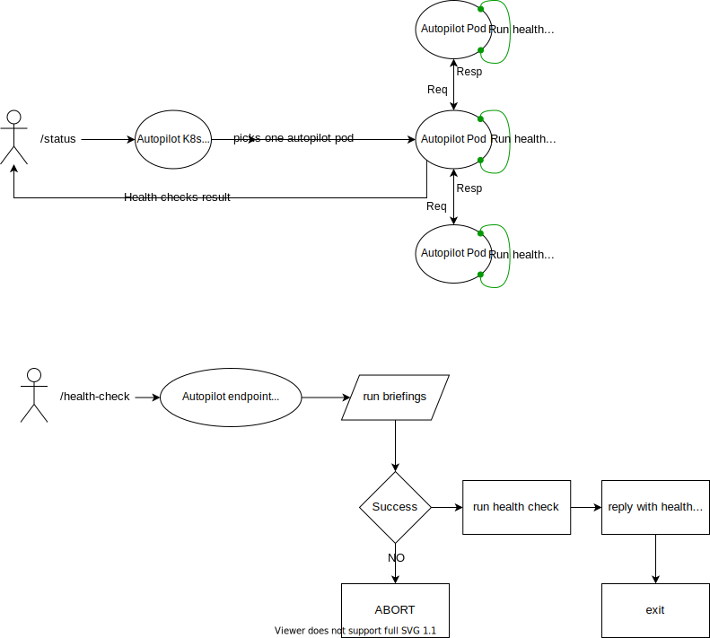
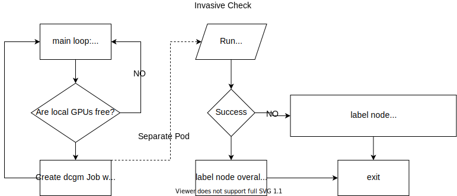

# Health Checks

Here is a breakdown of the existing health checks:

1. **PCIe Bandwidth Check (pciebw)**
    - Description  : Host-to-device connection speeds, one measurement per GPU. Codebase in tag [v12.4.1](https://github.com/NVIDIA/cuda-samples/tree/master/Samples/1_Utilities/bandwidthTest)
    - Outputs: Pass/fail results based on PCIe bandwidth thresholds.
    - Implementation: Compares bandwidth results to a threshold (e.g., 8 GB/s). If the measured bandwidth falls below the threshold, it triggers a failure.
    - It is recommended to set a threshold that is 25% or lower of the expected peak PCIe bandwidth capability, which maps to maximum peak from 16 lanes to 4 lanes. For example, for a PCIe Gen4x16, reported peak bandwidth is 63GB/s. A degradation at 25% is 15.75GB/s, which corresponds to PCIe Gen4x4.
    - The measured bandwidth is expected to be at least 80% of the expected peak PCIe generation bandwidth.
2. **GPU Memory Check (remapped)**
    - Description: Information from nvidia-smi regarding GPU memory remapped rows.
    - Outputs: Reports the state of GPU memory (normal/faulty).
    - Implementation: Analyzes remapped rows information to assess potential GPU memory issues.
3. **GPU Memory Bandwidth Performance (gpumem)**
    - Description: Memory bandwidth measurements using DAXPY and DGEMM.
    - Outputs: Performance metrics (eg., TFlops, power).
    - Implementation: CUDA code that valuates memory bandwidth and flags deviations from expected performance values.
4. **GPU Diagnostics (dcgm)**
    - Description: Runs NVidia DCGM diagnostics using dcgmi diag.
    - Outputs: Diagnostic results (pass/fail).
    - Implementation: Analyzes GPU health, including memory, power, and thermal performance.
5. **PVC Create/Delete (pvc)**
    - Description: Given a storage class, tests if a PVC can be created and deleted.
    - Output: pass/fail depending on the success or failure of creation and deletion of a PVC. If either operation fail, the result is a failure.
    - Implementation: creation of a PVC through K8s APIs.
6. **Network Reachability Check (ping)**
    - Description: Pings between nodes to assess connectivity.
    - Outputs: Pass/fail based on ping success.
    - Implementation: all-to-all reachability test.
7. **Network Bandwidth Check (iperf)**
    - Description: Tests network bandwidth by launching clients and servers on multiple interfaces through iperf3. Results are aggregated per interface results from network tests. Further details can be found in [the dedicated page](autopilot-daemon/network/README.md).
    - Outputs: Aggregate bandwidth on each interface, per node (in Gb/s).
    - Implementation: Tests network bandwidth by launching clients and servers on multiple interfaces and by running a ring topology on all network interfaces found on the pod that are exposed by network controllers like multi-nic CNI, which exposes fast network interfaces in the pods requesting them. Does not run on `eth0`.

These checks are configured to run periodically (e.g., hourly), and results are accessible via Prometheus, direct API queries or labels on the worker nodes.



## Deep Diagnostics and Node Labeling

Autopilot's periodic health checks, will label the worker nodes according to the result obtained.
Lightweight and invasive health checks, may use different labeling system.

If the health checks, lightweight or invasive, report success, the node is marked with

```yaml
autopilot.ibm.com/gpuhealth: PASS
```

When the lightweight health checks report an issue, the node is labelled with

```yaml
autopilot.ibm.com/gpuhealth: WARN
```

### Invasive health checks

The invasive DCGM diagnostics level 3 health check, executed automatically only on nodes that have free GPUs. This deeper analysis is needed to reveal problems in the GPUs that can be found only after running level 3 DCGM diagnostic.



This type of diagnostics can help deciding if the worker node should be used for running workloads or not. To facilitate this task, Autopilot will label nodes with key `autopilot.ibm.com/dcgm.level.3`.

If a fatal error is found, the `gpuhealth` label is updated to evict.

```yaml
autopilot.ibm.com/gpuhealth: EVICT
```

Only fatal errors should produce an `EVICT` label. We follow [NVIDIA recommendations](https://docs.nvidia.com/datacenter/dcgm/latest/user-guide/feature-overview.html#id3), although it is possible to customize the list of tests through the Helm chart. The default values are `[PCIe,NVLink,ECC,GPU Memory]`.

If errors are found during the level 3 diagnostics, the label `autopilot.ibm.com/dcgm.level.3` will contain detailed information about the error in the following format:

```yaml
autopilot.ibm.com/dcgm.level.3: ERR_Year-Month-Date_Hour.Minute.UTC_Diagnostic_Test.gpuID,Diagnostic_Test.gpuID,...`
```

- `ERR`: An indicator that an error has occurred
- `Year-Month-Date_Hour.Minute.UTC`: Timestamp of completed diagnostics
- `Diagnostic_Test`: Name of the test that has failed (formatted to replace spaces with underscores)
- `gpuID`: ID of GPU where the failure has occurred

**Example:** `autopilot.ibm.com/dcgm.level.3=ERR_2024-10-10_19.12.03UTC_page_retirement_row_remap.0`

If there are no errors, the value is set to `PASS_Year-Month-Date_Hour.Minute.UTC`.

### Logs and Metrics

All health checks results are exported through Prometheus, but they can be also found in each pod's logs.

All metrics are accessible through Prometheus and Grafana dashboards. The gauge exposed is `autopilot_health_checks` and can be customized with the following filters:

- `check`, select one or more specific health checks
- `node`, filter by node name
- `cpumodel` and `gpumodel`, for heterogeneous clusters
- `deviceid` to select specific GPUs, when available

For more information on how to set up alerts based on metrics, please refer to the [alert manager folder](alertmanager/README.md).
