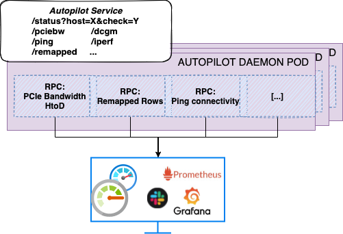
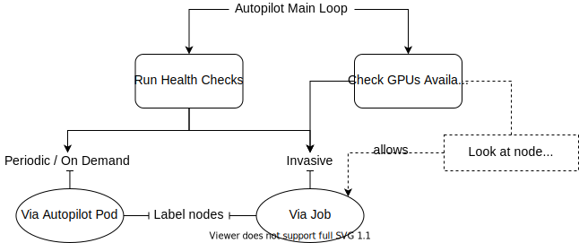
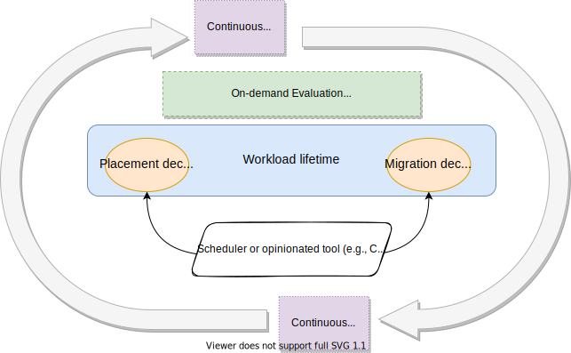

# AI Training Autopilot

Autopilot is a Kubernetes-native daemon that continuously monitors and evaluates GPUs, network and storage health, designed to detect and report infrastructure-level issues during the lifetime of AI workloads. It is an open-source project developed by IBM Research.

In AI training jobs, which may run for weeks or months, anomalies in the GPUs and network can happen anytime and often go undetected. In this case, performance degrades suddenly and a deep diagnostic is needed to identify the root cause, delaying or deleting the current job. Similarly, hardware anomalies can greatly disrupt the throughput and latency of an AI inference server.

The role of Autopilot is to detect and report any problems that are detected by its health checks during the lifetime of the job and the existence of a cluster.

It implements a set of health checks evaluating the status of the system. These health checks focus mainly on subtle/software issues (i.e., row-remapping or PCIe link degradation), but also run connectivity tests (i.e., ping, iperf) to verify that secondary NICs are reachable. It can also verify that persistent volume claims (PVC) creation is functional for a given storage class.

Autopilot is deployed as a Kubernetes DaemonSet on all worker nodes that have GPUs. Each pod exposes a Service that can be accessed through RESTful API to request the execution of health checks. Therefore, each health check has its own entry point, but also a generic “status” entry point is provided.

The DaemonSet does not run as privileged and requires access to GPUs without requesting them as resources. Therefore, the GPUs are seen as available by the scheduler.

The main code is written in Go, while health checks are written in a combination of Python, Go, bash and CUDA. Each Autopilot pod runs health checks only on the node it resides. A pod can request other pods to run health checks on their nodes, and in that case, results are gathered and showed by the requestor pod.

If Autopilot requires full access to GPUs to run more invasive workloads, it will spawn a separate job with resources requests and limits set.

## Health Checks

The current status of Autopilot includes:

- **GPU PCIe Link Bandwidth**: The PCIe NVidia bandwidth test to check host-to-device connection on each node
- **GPU Memory**: GPUs remapped rows evaluation through `nvidia-smi`
- **GPU Memory Bandwidth Performance**: GPUs memory bandwidth evaluation through DAXPY and DGEMM
- **GPU Diagnostics**: NVidia DCGM (Data Center GPU Manager) diagnostics through `dcgmi diag`
- **GPU Power Slowdown**: verify if power throttle is active through `nvidia-smi`
- **Network Reachability**: `ping` to evaluate hosts reachability
- **Network Bandwidth**: `iperf3` to evaluate network bandwidth and hosts connectivity
- **PVC Create/Delete**: given a storageclass, test the ability to successfully provision a Persistent Volume Claim
- **DCGM level 3**: deep diagnostics through NVidia DCGM tool. This test runs as a separate Job that reserves all the GPUs in the node if they are free

A subset of the tests is enabled by default, and they run by default every hour. Both the the list of health checks and the timer can be customized at initialization time.

By default, the periodic checks list contains PCIe, rows remapping, GPUs power, DCGM level 1 and ping.

Results from health checks are exported as Prometheus Gauges, so that users and admins can easily check the status of the system on Grafana.

Detailed description of all the health checks, can be found in [HEALTH_CHECKS.md](HEALTH_CHECKS.md).

### Diagnostics and Node Labeling

Autopilot's periodic and invasive health checks, will label the worker nodes according to the result obtained.
Lightweight and invasive health checks, may use different labeling system. Refer to [HEALTH_CHECKS.md](HEALTH_CHECKS.md) for more details about the labels format.

The information saved in the labels, can be used by admins, kube-scheduler or other workload management systems like [CodeFlare](https://project-codeflare.github.io/appwrapper/arch-fault-tolerance/) to steer the execution of workloads for enhanced fault tolerance.

## Install

To learn how to install Autopilot, please refer to [SETUP.md](SETUP.md)

## Usage

To learn how to invoke health checks, please refer to [USAGE.md](USAGE.md).
