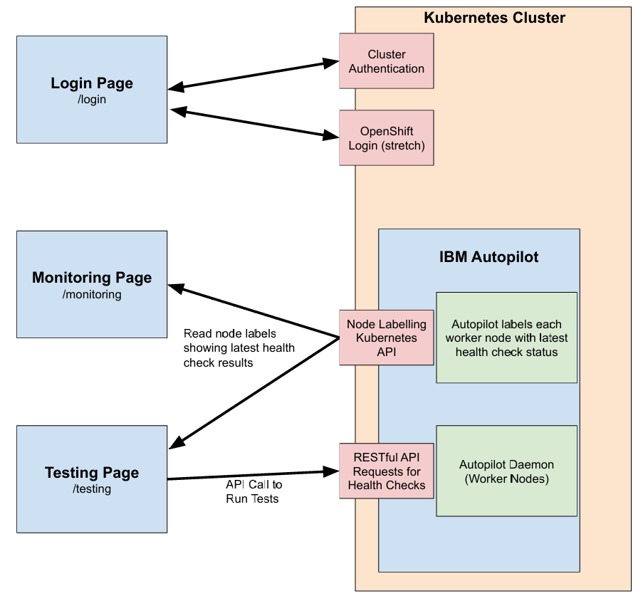
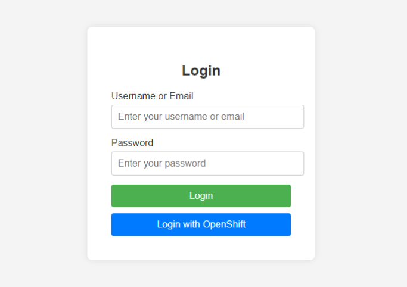

** **

## IBM Autopilot Dashboard

** **

## 1.   Vision and Goals Of The Project:

Autopilot is a Kubernetes-native daemon that continuously monitors and evaluates GPUs, network and storage health, designed to detect and report infrastructure-level issues during the lifetime of AI workloads. It is an open-source project developed by IBM Research.

Our vision is to develop a fully functional UI dashboard for Autopilot, integrated with a GPU-equipped OpenShift/Kubernetes cluster. The dashboard will allow administrators to monitor cluster status, initiate health check tests, and view real-time results within an embedded terminal window. The entire system should provide a streamlined and intuitive interface, simplifying the complex tasks of cluster management while ensuring efficient test deployment and monitoring.

Along the way, we will ensure the dashboard offers clear, actionable insights into cluster health and performance, facilitating informed decision-making. The goal is to empower administrators with a tool that enhances visibility, control, and responsiveness in managing clusters supporting AI workloads.

## 2. Users/Personas Of The Project:

 <ins>**User 1: Data Scientists e.g. Martin (general user)**</ins>
 IBM Autopilot is designed for someone who needs to run AI workloads and detect the infrastructure-level issues for these jobs. IBM Autopilot will also be used for anyone who requires health checks on the system.  IBM Autopilot realizes these purposes by continuously monitoring and evaluating hardware and devices such as network, storage, and GPUs.

-  **Role and background description:** Martin is a data scientist. His daily tasks involve processing large amounts of data and performing complex computations. One good example would be training deep learning neural networks.
  
-  **Needs and goals:** Martin submitted a training job that takes weeks to run. It would be beneficial for Martin to have an interactive dashboard/profiler that allows him to monitor the status of his training jobs, including the status of the cluster, and the requested GPUs. He would be notified when there is an error and get the problem resolved by himself.

<ins> **User 2: Administrators e.g. Jessy** </ins>

-  **Role and background description:** Jessy is a system administrator responsible for managing and maintaining a computing cluster. Her main tasks include ensuring health and performance of hardware resources such as GPUs, network, and storage systems. She runs health checks with detailed diagnostic tools and fixes them when notified. In other words, Jessy would be notified by Martin to resolve his training job issues.

-  **Needs and goals:** Jessy would need an interface that allows her to view Martin’s computing cluster usage and carry out detailed diagnostics to resolve Martin’s problems.

## 3.   Scope and Features Of The Project:

## 4. Solution Concept

### Solution Overview

The Autopilot Dashboard UI will be in React.js and will include 3 key pages. The first will be the Login page which allows users to enter their login credentials and separates them between administrators (those who can run tests) and viewers (those who can only view status of past tests). OpenShift Login integration will be a stretch goal for this page. The next page will be the Monitoring page which will allow users to monitor the status of each worker node and the results of their most recent health checks. The final page will be the Testing page which is only available for administrators and allows them to select a set of health checks to be run on a set of worker nodes.

### Architecture Structure

The diagram above illustrates the architecture for the IBM Autopilot Dashboard. It consists of three primary pages: Login Page, Monitoring Page, and Testing Page. These pages interact with the Kubernetes cluster running Autopilot.

* The **Login Page** allows for user authentication to the cluster, integrating OpenShift login (stretch goal), and grants either admin or viewer access based on credentials.
* The **Monitoring Page** fetches the most recent health check results from Autopilot’s labelling of the worker nodes (using the Kubernetes API), allowing users to view the status of the worker nodes.
* The **Testing Page** enables administrators to run health checks on worker nodes by sending REST API requests to IBM Autopilot. These requests trigger tests that assess the health of GPUs and other components in the cluster.

Within the cluster, IBM Autopilot runs as a DaemonSet across worker nodes, executing health checks and diagnostics on GPU, network, and storage components.

NOTE: Our application is a dashboard for Autopilot, so the diagram only includes the components of Autopilot which directly interact with the dashboard. Most of Autopilot’s inner workings are not shown for simplicity.

### Front-End Description

**Sample Login Page**

The Login page will be the first page users see on the site. Users will enter in their login credentials and the application will determine if they have admin privileges or viewer privileges (or none at all). The ability to login through OpenShift (OpenShift login integration) will be a stretch goal for our project as mentioned in the “Acceptance Criteria” section below.

**Sample Monitoring Page**

The Monitoring page is used to view all of the worker nodes and the status of their most recent health checks. Initially, all nodes are displayed with failing nodes at the top. However, nodes can be filtered in various ways, including by status code (PASS/ERR), hardware type (GPU, CPU, etc.), and by ID. Users can view the status of a node’s health checks by clicking on and expanding the associated box.

**Sample Testing Page**

(insert image)

### Back-End Description

**Health Checks:**

Currently, Autopilot supports 9 tests or health checks which can be run on each worker node. The Monitoring page will display the most recent status of these tests on each node, and the Testing page will allow for the deployment of these tests. Below are the descriptions of each of the health checks taken from the IBM Autopilot README.

- **GPU PCIe Link Bandwidth**: The PCIe NVidia bandwidth test to check host-to-device connection on each node
- **GPU Memory**: GPUs remapped rows evaluation through `nvidia-smi`
- **GPU Memory Bandwidth Performance**: GPUs memory bandwidth evaluation through DAXPY and DGEMM
- **GPU Diagnostics**: NVidia DCGM (Data Center GPU Manager) diagnostics through `dcgmi diag`
- **GPU Power Slowdown**: verify if power throttle is active through `nvidia-smi`
- **Network Reachability**: `ping` to evaluate hosts reachability
- **Network Bandwidth**: `iperf3` to evaluate network bandwidth and hosts connectivity
- **PVC Create/Delete**: given a storageclass, test the ability to successfully provision a Persistent Volume Claim
- **DCGM level 3**: deep diagnostics through NVidia DCGM tool. This test runs as a separate Job that reserves all the GPUs in the node if they are free

**Node Labelling:**

Results from the latest health checks are labelled in each worker node by Autopilot. Node labels can be easily read/pulled from the Kubernetes API. The dashboard’s Monitoring and Testing pages will leverage this and the corresponding filters to retrieve information regarding the status of each node’s health checks.

**RESTful API Requests for Tests Deployment:**

Autopilot is deployed as a Kubernetes DaemonSet, where each pod exposes a service which can execute health checks. This service can be accessed through RESTful API. Each health check has its own entry point, but there is also generic “status” entry point for viewing. The Testing page will call these APIs to trigger health checks. Autopilot allows for easy customization of testing requests. Shown below are the tailoring options for tests taken from the Autopilot README:

All tests can be tailored by a combination of:

- `host=<hostname1,hostname2,...>`, to run all tests on a specific node or on a comma separated list of nodes.
- `check=<healthcheck1,healtcheck2,...>`, to run a single test (`pciebw`, `dcgm`, `remapped`, `gpumem`, `ping`, `iperf` or `all`) or a list of comma separated tests. When no parameters are specified, only `pciebw`, `dcgm`, `remapped`, `ping` tests are run.
- `batch=<#hosts>`, how many hosts to check at a single moment. Requests to the batch are run in parallel asynchronously. Batching is done to avoid running too many requests in parallel when the number of worker nodes increases. Defaults to all nodes.

### Design Implications and Discussion ###

**Front-End UI**

The three page architecture keeps our dashboard simple yet organized by privilege/access. The Login page serves the purpose of discerning between admins and viewers (determining privilege). The separation of the Monitoring and Testing pages allows for cleaner development and also simplifies user experience. Viewers only have access to the Monitoring page, and if admins only wish to view system status, they can comfortably use the Monitoring page without worrying about accidentally running tests. The Testing page serves the specific purpose of running tests (health checks), which is only available to admins when they wish to deploy tests to the system. This separation leads to less user error.

We have decided to use React.js to build the user interface of the dashboard. There are several reasons behind this decision.
* React’s component-based architecture allows for code reusability and easy maintenance. Much of the Monitoring and Testing pages will have very similar components (dropdown menu, search bar, expandable boxes), so component-based architecture is needed for faster development and better maintenance.
* React allows for faster rendering through its virtual DOM feature, improving user experience by reducing latency of the app.
* Being one of the most popular front-end frameworks/libraries, React has a very large an active community, allowing for widespread availability of open source front-end components and documentation, which we can leverage for faster and cleaner development.

**Back-End Design**

Most of the back-end design comes from the existing architecture of IBM Autopilot. There was not much to decide as the dashboard is simply using available APIs. For example, for the Testing page to run tests it must use Autopilot’s RESTful APIs. There are many reasons behind Autopilot’s implementation of RESTful APIs (statelessness, scalability, etc.), but these reasons were considered during the development of Autopilot and are out of scope for this README as it focuses specifically on the Autopilot Dashboard.

Although OpenShift Login integration is a stretch goal, the reason behind its planned addition is to improve user experience when logging in by easing the process. Connecting to a user’s existing OpenShift account will simplify and streamline the login process as the user won’t have to remember their specific credentials for the cluster and can instead use one central account.

A key decision we had to make was how to read the latest health check status of each node for the Monitoring page. We had a few options to choose from:

* Read the logs for each pod. This is not desirable as it is tedious to go through every single pod, open, and scrape the logs for results.
* Scrape the Prometheus export. Autopilot exports the results of the health checks as Prometheus Gauges. This may work but requires scraping (which can get tedious).
* Read labels on the worker nodes containing results from the latest health checks. This is the most lightweight option as the labels can be easily read from the Kubernetes API and do not require scraping.

We of course chose the third option as it is the most lightweight and does not require any scraping. The labels can be read from the easy to use Kubernetes API, allowing for easier development and better maintainability.

## 5. Acceptance criteria

Minimum Acceptance Criteria: 
* Ability to deploy Autopilot tests through web UI and see results 
* Ability to view node/system status and latest health check results through web UI

Stretch Goals:
* Ability to view recent test history
* Integration with OpenShift login system

## 6.  Release Planning:

