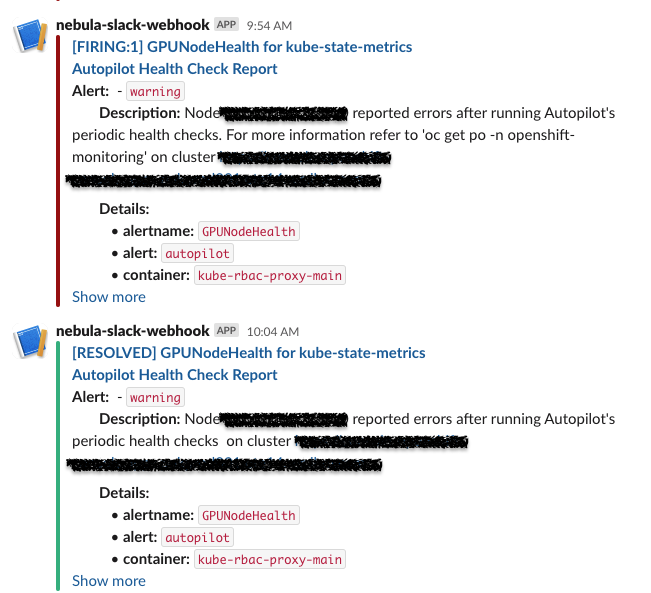

# Alerting for autopilot tests on OpenShift clusters

Autopilot can issue alerts when:

1) any health check reports an issue
2) a node is labeled with `ERR` as a result of an health check
3) any of the Autopilot pods fail.

This folder contains the files needed to enable the above alerts and to set up Slack notifications using Prometheus and AlertManager on OpenShift.

There are 3 main steps to set it up:

1) Create `PrometheusRules` (alerting rules)
2) Create a Slack webhook application
3) Create an `AlertManager` Receiver

These steps are explained in more detail below.

## Create alerting rules for Prometheus

```console
oc project openshift-monitoring
oc create -f healthchecks-alerts.yaml
```

Note the following in the example below:

- The `PrometheusRule` is created in the `openshift-monitoring` namespace - this is the namespace where Prometheus and Alert Manager is deployed on the OpenShift cluster.
- The `alert: autopilot` label is added to match the alert with an Alert Manager receiver that we will create in the last step. This is how Prometheus knows which Alert Manager receiver to send the alert to.

For example: `sum (autopilot_health_checks{health="pciebw"}<=4) by (node, deviceid, value) > 0` is the PromQL query used to count how many nodes have a GPU device with a PCIE bandwidth of less than 4.

```yaml
- alert: LowPCIeBandwidth
      annotations:
        description: |
          GPU device {{ $labels.deviceid }} on node {{ $labels.node }} has a PCIE bandwidth of {{ $value }} {{ with $console_url := "console_url" | query }}{{ if ne (len (label "url" (first $console_url ) ) ) 0}} on cluster {{ label "url" (first $console_url) }}{{ end }}{{ end }}.
        summary: GPU with a PCIe bandwidth of 4 or less 
      expr: |
        sum (autopilot_health_checks{health="pciebw"}<=4) by (node, deviceid, value) > 0
      for: 1m
      labels:
        severity: warning
        alert: autopilot
```

## Observe OpenShift dashboard notifications

Once you have deployed the above `PrometheusRules`, you should start seeing alerts in the OpenShift dashboard when one of the autopilot tests fails. For example, this alert below warns about low PCIE bandwidth on a GPU device on a node:


## Create a Slack incoming webhook application

- Create a Slack workspace using your personal Slack account
- Go to https://slack.com/apps and select your workspace from the dropdown menu in the top right of the page
- Click on `Get Essential Apps` and search the App Directory for `Incoming WebHooks`

You should see a page like this:


If there is no existing webhook, you can create one by following the official documentations [here](https://api.slack.com/messaging/webhooks).

- Click on `Add to Slack` and choose which Slack channel to post messages to from the dropdown menu or create a new channel.

- Click on `Add Incoming Webhooks Integration`

- Copy and paste the `WebhookURL`. We will use this when we configure the `AlertManager` Receiver in the next step.
It should look something like this:

```bash
https://hooks.slack.com/services/<some-hash>
```

## Create an `AlertManager` receiver using Slack through the OpenShift Web UI

- Log into the OpenShift WebUI as an admin
- Click on Administration -> Cluster Settings -> Configuration -> Alertmanager

You should see this page:


Click on `Create Receiver`

- Choose a Receiver name and set the Receiver type as Slack
- Click on `Create` and fill out the following fields:

  - Paste the Slack Webhook URL you copied in the previous step into the `Slack API URL` field
  - Write the Slack channel name to send notifications to in the `Channel field`
  - Click on `Show advanced configuration`
    - We suggest to set the title as follows:

    ```console
    [{{ .Status | toUpper }}{{ if eq .Status "firing" }}:{{ .Alerts.Firing | len }}{{ end }}] {{ .CommonLabels.alertname }} for {{ .CommonLabels.job }}
    Autopilot Health Check Report
    ```

    - We suggest to set the text as follows:

    ```console
    {{ range .Alerts -}}
        *Alert:* {{ .Annotations.title }}{{ if .Labels.severity }} - `{{ .Labels.severity }}`{{ end }}
        *Description:* {{ .Annotations.description }}
        *Details:*
          {{ range .Labels.SortedPairs }} • *{{ .Name }}:* `{{ .Value }}`
          {{ end }}
        {{ end }}
    ```

  - In the Routing Labels section, provide the label that we provided in the Prometheus `AlertingRule` in the first step.
    - Set it to `alert=autopilot`, which is a label added in the various Prometheus Rules in `healthchecks-alerts.yaml`
    This ensures that Prometheus will route the `AlertingRule` we created to this specific `AlertManager` receiver.

- Click on `Save`

This will generate a yaml file like `alertmanager.yaml` in this folder and will update the `AlertManager` pod configuration to add your new receiver. Now we will start receiving alerts from the Prometheus `AlertingRule` we created. Note that in `alertmanager.yaml`, there is a `critical` receiver to catch all the `critical` alerts. Some of the Autopilot alerts also have the `severity=critical` label (for instance, `dcgm level 3` or `ping`), but those will be captured by the `alert=autopilot` label anyways.

You can check the status of the `AlertManager` pod with this command:

```console
oc -n openshift-monitoring logs -l 'alertmanager=main'
```

That's it! Now you can get notifications in Slack every time an autopilot test fails or if any of the pods fail. If there is something else you wish to get notification for, you simply need to create a new `PrometheusRule` with a new `expr` and label, and create a new `AlertManager` Slack receiver with a matching label.

Below is an example of a Slack alert of a firing and then resolved rule.

