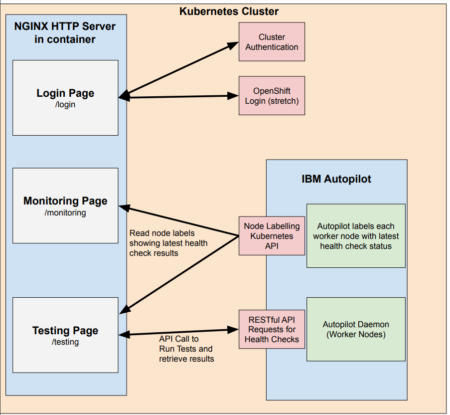
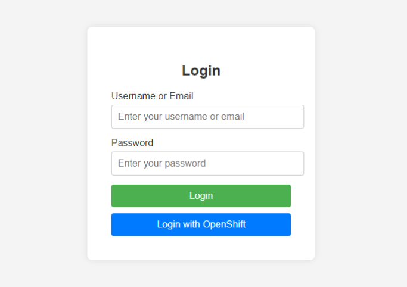
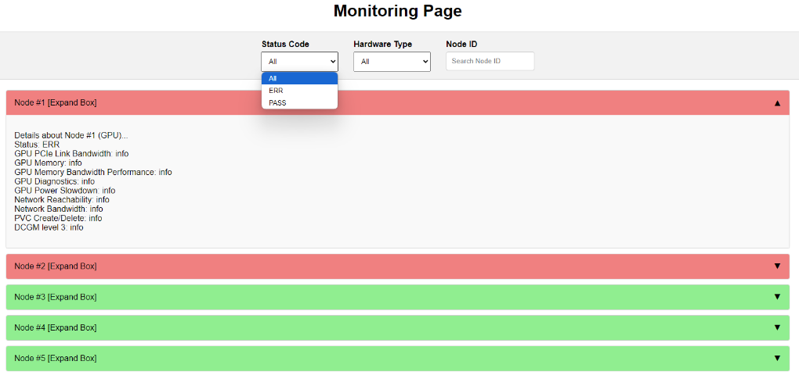
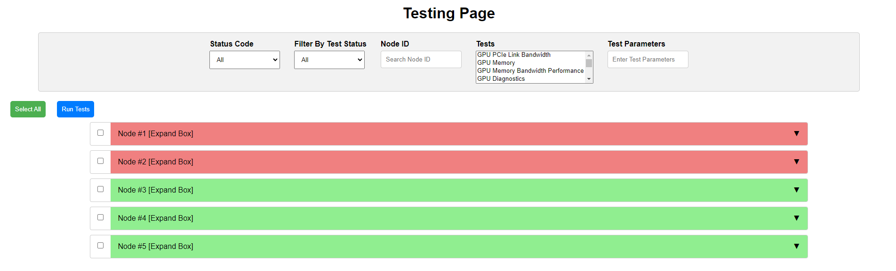

** **

## IBM Autopilot Dashboard

## Team Members

| Names              | Roles   | Emails                |
| :----------------- | ------- | --------------------- |
| James Cadden       | Mentor  | jcadden@ibm.com       |
| Claudia Misale     | Mentor  | c.misale@ibm.com      |
| Tyler Rimaldi      | Mentor  | tyler.rimaldi@ibm.com |
| Ellen Burhansjah   | Student | eburhan@bu.edu        |
| Anish Sinha        | Student | anishs@bu.edu         |
| Mete Gumusayak     | Student | mgumus@bu.edu         |
| Joshua Arrevillaga | Student | arrejosh@bu.edu       |
| Ryan Liao          | Student | ryanliao@bu.edu       |
| Jingyi Zhang       | Student | jyz0328@bu.edu        |

## Sprint Demo Videos and Slides

1. ### [Sprint 1 Demo](https://youtu.be/5iCPQ0IaMHA)

   - [Sprint 1 Demo Slide](https://docs.google.com/presentation/d/1aPIBoEaY4MrJwOelWEHnzL7PwBBRUeGN2msTvbXrTwc/edit?usp=sharing)

2. ### [Sprint 2 Demo](https://youtu.be/qW1zDtuH2ug)
   
   - [Sprint 2 Demo Slide](https://docs.google.com/presentation/d/1McQLv38CLnFPsv0KiufjC5g9H5iq3BwkFWDeaK6zTL4/edit?usp=sharing)
     
3. ### [Sprint 3 Demo](https://youtu.be/6QA7rMSbpqo)
   
   - [Sprint 3 Demo Slide](https://docs.google.com/presentation/d/1lOXK8GLUxTaVbzHugg61_txEEE_1HK5XjKPgHOLKdcM/edit?usp=sharing)
   - [OpenShift Deployment](https://sprint3-autopilot-dashboard-f3dc9e.apps.shift.nerc.mghpcc.org)

4. ### [Sprint 4 Demo](https://youtu.be/rCoLDlV7pDA)

   - [Sprint 4 Demo Slide](https://docs.google.com/presentation/d/1kNkAz926yURKGQpXppM6pAH3eHPI8d_wr_910gF1358/edit#slide=id.g308583e7967_0_285)
   - [OpenShift Deployment](https://sprint4-autopilot-dashboard-f3dc9e.apps.shift.nerc.mghpcc.org)
  
5. Due November 20th/November 25th

Final Presentation: Due December 9th/December 11th

** **

## 1.   Vision and Goals Of The Project:

Autopilot is a Kubernetes-native daemon that continuously monitors and evaluates GPUs, network and storage health, designed to detect and report infrastructure-level issues during the lifetime of AI workloads. It is an open-source project developed by IBM Research.

Our vision is to develop a fully functional UI dashboard for Autopilot, integrated with a GPU-equipped OpenShift/Kubernetes cluster. The dashboard will allow administrators to monitor cluster status, initiate health check tests, and view real-time results within an embedded terminal window. The entire system should provide a streamlined and intuitive interface, simplifying the complex tasks of cluster management while ensuring efficient test deployment and monitoring.

Along the way, we will ensure the dashboard offers clear, actionable insights into cluster health and performance, facilitating informed decision-making. The goal is to empower administrators with a tool that enhances visibility, control, and responsiveness in managing clusters supporting AI workloads.


## 2. Users/Personas Of The Project:
 IBM Autopilot is designed for someone who needs to run AI workloads and detect the infrastructure-level issues for these jobs. IBM Autopilot will also be used for anyone who requires health checks on the system.  IBM Autopilot realizes these purposes by continuously monitoring and evaluating hardware and devices such as network, storage, and GPUs.
 
 <ins>**User 1: Data Scientists e.g. Martin (general user)**</ins>
 

-  **Role and background description:** Martin is a data scientist. His daily tasks involve processing large amounts of data and performing complex computations. One good example would be training deep learning neural networks.
  
-  **Needs and goals:** Martin submitted a training job that takes weeks to run. It would be beneficial for Martin to have an interactive dashboard/profiler that allows him to monitor the status of his training jobs, including the status of the cluster, and the requested GPUs. He would be notified when there is an error and get the problem resolved by himself.

<ins> **User 2: Administrators e.g. Jessy** </ins>

-  **Role and background description:** Jessy is a system administrator responsible for managing and maintaining a computing cluster. Her main tasks include ensuring health and performance of hardware resources such as GPUs, network, and storage systems. She runs health checks with detailed diagnostic tools and fixes them when notified. In other words, Jessy would be notified by Martin to resolve his training job issues.

-  **Needs and goals:** Jessy would need an interface that allows her to view Martin’s computing cluster usage and carry out detailed diagnostics to resolve Martin’s problems.

## 3.   Scope and Features Of The Project:
### Features: In-Scope
* **Embedded Terminal:** Once an Autopilot test is complete or when a user requests a current status update, results will be displayed in an embedded read-only terminal window in way that ensures a clear and easy-to-view format for quick analysis.
* **Dashboard Overview:** The dashboard provides real-time insights into the health and performance of Kubernetes/OpenShift clusters, specifically tailored for administrators manage GPU-equipped environments. Serving as the primary user interface, it offers a comprehensive view of the environment's current status, facilitating ease and use of quick access to critical operational data. This tool is essential for administrators to monitor system health, initiate necessary actions through the 9 Autopilot health checks, and ensure optimal cluster performance and stability.
* **Monitoring Page:** The monitoring page will contain a list of all the nodes with a dropdown menu of each of their statuses. There will also be a filter dropdown menu that will allow the user to view specific nodes based on their features as well as a function to search by node ID.
* **Testing Page:** The testing page will be accessed through the monitoring page and will allow the user to run tests on different nodes.

### Features: Stretch Goal
* **Recent Test History:** The Autopilot dashboard will include a convenient "Recent History" dropdown menu designed to streamline administrative tasks. This feature prominently displays the administrator's most recent test executions, listing details such as test type, associated node names, and timestamps. By selecting from the dropdown, administrators can quickly rerun tests without the need to locate specific nodes or navigate through previous logs. This functionality not only enhances operational efficiency but also provides a user-friendly interface that simplifies the management and monitoring of GPU-equipped Kubernetes/OpenShift clusters.

### Features: Out-of-Scope
* **Improving Autopilot:** Autopilot is already a fully functional Kubernetes-native daemon that will detect many infrastructure-level issues during AI workloads. Our goal is not to improve this already working service but to implement the UI dashboard to make it more accessible and easier to use. However, if there is additional time after creating the dashboard, we will dedicate time to improve Autopilot by either fixing existing bugs or adding on more features/tests.


## 4. Solution Concept

### Solution Overview

The Autopilot Dashboard UI will be in React.js and will include 3 key pages. The first will be the Login page which allows users to enter their login credentials and separates them between administrators (those who can run tests) and viewers (those who can only view status of past tests). OpenShift Login integration will be a stretch goal for this page. The next page will be the Monitoring page which will allow users to monitor the status of each worker node and the results of their most recent health checks. The final page will be the Testing page which is only available for administrators and allows them to select a set of health checks to be run on a set of worker nodes.

### Architecture Structure



The diagram above illustrates the architecture for the IBM Autopilot Dashboard. It consists of three primary pages: Login Page, Monitoring Page, and Testing Page. These pages are hosted on a HTTP NGINX server running within a container on the Kubernetes cluster.

* The **Login Page** allows for user authentication to the cluster, integrating OpenShift login (stretch goal), and grants either admin or viewer access based on credentials.
* The **Monitoring Page** fetches the most recent health check results from Autopilot’s labelling of the worker nodes (using the Kubernetes API), allowing users to view the status of the worker nodes.
* The **Testing Page** enables administrators to run health checks on worker nodes by sending REST API requests to IBM Autopilot. These requests trigger tests that assess the health of GPUs and other components in the cluster. The results of the executed tests are returned to this page and appear in an embedded terminal window.

Within the cluster, IBM Autopilot runs as a DaemonSet across worker nodes, executing health checks and diagnostics on GPU, network, and storage components. For context, a Kubernetes DaemonSet ensures that all Nodes matching a certain criteria run a copy of a Pod.

NOTE: Our application is a dashboard for Autopilot, so the diagram only includes the components of Autopilot which directly interact with the dashboard. Most of Autopilot’s inner workings are not shown for simplicity.

### Front-End Description

**Sample Login Page**



The Login page will be the first page users see on the site. Users will enter in their login credentials and the application will determine if they have admin privileges or viewer privileges (or none at all). The ability to login through OpenShift (OpenShift login integration) will be a stretch goal for our project as mentioned in the “Acceptance Criteria” section below.

**Sample Monitoring Page**



The Monitoring page is used to view all of the worker nodes and the status of their most recent health checks. Initially, all nodes are displayed with failing nodes at the top. However, nodes can be filtered in various ways, including by status code (PASS/ERR), hardware type (GPU, CPU, etc.), and by ID. Users can view the status of a node’s health checks by clicking on and expanding the associated box.

**Sample Testing Page**



This testing page will be used to select the set of nodes and the health checks/tests the user wants to run. Users will be able to select the tests (health checks) they would like to run using a dropdown menu and can input test parameters when necessary. Similar to the Monitoring page, nodes can be selected using a variety of filters, including one for most recent test status and a search by ID. Once all of the filters are applied and the matching nodes are displayed, a select all button can be pressed to select all of the nodes that match the filter inputs. Once the user has selected a set of tests (with appropriate test parameters) and a set of nodes, the Testing page will send a RESTful API request to IBM Autopilot to run the given tests on the given nodes and the results will be shown in an embedded terminal window.

### Back-End Description

**Health Checks:**

Currently, Autopilot supports 9 tests or health checks which can be run on each worker node. The Monitoring page will display the most recent status of these tests on each node, and the Testing page will allow for the deployment of these tests. Below are the descriptions of each of the health checks taken from the IBM Autopilot README.

- **GPU PCIe Link Bandwidth**: The PCIe NVidia bandwidth test to check host-to-device connection on each node
- **GPU Memory**: GPUs remapped rows evaluation through `nvidia-smi`
- **GPU Memory Bandwidth Performance**: GPUs memory bandwidth evaluation through DAXPY and DGEMM
- **GPU Diagnostics**: NVidia DCGM (Data Center GPU Manager) diagnostics through `dcgmi diag`
- **GPU Power Slowdown**: verify if power throttle is active through `nvidia-smi`
- **Network Reachability**: `ping` to evaluate hosts reachability
- **Network Bandwidth**: `iperf3` to evaluate network bandwidth and hosts connectivity
- **PVC Create/Delete**: given a storageclass, test the ability to successfully provision a Persistent Volume Claim
- **DCGM level 3**: deep diagnostics through NVidia DCGM tool. This test runs as a separate Job that reserves all the GPUs in the node if they are free

**Node Labelling:**

Results from the latest health checks are labelled in each worker node by Autopilot. Node labels can be easily read/pulled from the Kubernetes API. The dashboard’s Monitoring and Testing pages will leverage this and the corresponding filters to retrieve information regarding the status of each node’s health checks.

**RESTful API Requests for Tests Deployment:**

Autopilot is deployed as a Kubernetes DaemonSet, where each pod exposes a service which can execute health checks. This service can be accessed through RESTful API. Each health check has its own entry point, but there is also generic “status” entry point for viewing. The Testing page will call these APIs to trigger health checks. Autopilot allows for easy customization of testing requests. Shown below are the tailoring options for tests taken from the Autopilot README:

All tests can be tailored by a combination of:

- `host=<hostname1,hostname2,...>`, to run all tests on a specific node or on a comma separated list of nodes.
- `check=<healthcheck1,healtcheck2,...>`, to run a single test (`pciebw`, `dcgm`, `remapped`, `gpumem`, `ping`, `iperf` or `all`) or a list of comma separated tests. When no parameters are specified, only `pciebw`, `dcgm`, `remapped`, `ping` tests are run.
- `batch=<#hosts>`, how many hosts to check at a single moment. Requests to the batch are run in parallel asynchronously. Batching is done to avoid running too many requests in parallel when the number of worker nodes increases. Defaults to all nodes.

### Design Implications and Discussion ###

**Front-End UI**

The three page architecture keeps our dashboard simple yet organized by privilege/access. The Login page serves the purpose of discerning between admins and viewers (determining privilege). The separation of the Monitoring and Testing pages allows for cleaner development and also simplifies user experience. Viewers only have access to the Monitoring page, and if admins only wish to view system status, they can comfortably use the Monitoring page without worrying about accidentally running tests. The Testing page serves the specific purpose of running tests (health checks), which is only available to admins when they wish to deploy tests to the system. This separation leads to less user error.

We have decided to use React.js to build the user interface of the dashboard. There are several reasons behind this decision.
* React’s component-based architecture allows for code reusability and easy maintenance. Much of the Monitoring and Testing pages will have very similar components (dropdown menu, search bar, expandable boxes), so component-based architecture is needed for faster development and better maintenance.
* React allows for faster rendering through its virtual DOM feature, improving user experience by reducing latency of the app.
* Being one of the most popular front-end frameworks/libraries, React has a very large an active community, allowing for widespread availability of open source front-end components and documentation, which we can leverage for faster and cleaner development.

**Back-End Design**

Most of the back-end design comes from the existing architecture of IBM Autopilot. There was not much to decide as the dashboard is simply using available APIs. For example, for the Testing page to run tests it must use Autopilot’s RESTful APIs. There are many reasons behind Autopilot’s implementation of RESTful APIs (statelessness, scalability, etc.), but these reasons were considered during the development of Autopilot and are out of scope for this README as it focuses specifically on the Autopilot Dashboard.

Although OpenShift Login integration is a stretch goal, the reason behind its planned addition is to improve user experience when logging in by easing the process. Connecting to a user’s existing OpenShift account will simplify and streamline the login process as the user won’t have to remember their specific credentials for the cluster and can instead use one central account.

A key decision we had to make was how to read the latest health check status of each node for the Monitoring page. We had a few options to choose from:

* Read the logs for each pod. This is not desirable as it is tedious to go through every single pod, open, and scrape the logs for results.
* Scrape the Prometheus export. Autopilot exports the results of the health checks as Prometheus Gauges. This may work but requires scraping (which can get tedious).
* Read labels on the worker nodes containing results from the latest health checks. This is the most lightweight option as the labels can be easily read from the Kubernetes API and do not require scraping.

We of course chose the third option as it is the most lightweight and does not require any scraping. The labels can be read from the easy to use Kubernetes API, allowing for easier development and better maintainability.

**NGINX Server/Container**

We are using NGINX because it is a lightweight and high-performance web server. It is great for load balancing, allowing it to handle many concurrent connections and requests. It can also act as a reverse proxy able to forward requests to backend API endpoints. Our application will run on an NGINX HTTP server within a container on the cluster. We are choosing to run the container on the same cluster as Autopilot to simplify deployment and to also reduce network overhead (communication remains within same cluster).

## 5. Acceptance criteria

Minimum Acceptance Criteria: 
* Ability to deploy Autopilot tests through web UI and see results 
* Ability to view node/system status and latest health check results through web UI

Stretch Goals:
* Ability to view recent test history
* Integration with OpenShift login system


## 6.  Release Planning:

The release planning of this project will be based on the EC528 lecture regarding vertical and horizontal user story agile methodology. We wish to use **vertical slicing** to divide up the project, ensuring each sprint results in working, demonstrable software. We also aim to fulfill most required features for the user before implementing more additional features.  

1) **<i> September </i> [09/10 - 09/23]**

   Exploring Autopilot and initial setup
   
   - Designing global architecture/framework of the project and how it works.
   
   - Set web UI application design/overview.
   
   - Initial setup of the skeleton of the web application.

2) **<i> Late September - Early October </i> [09/24 - 10/07]**

   Get access to Kubernetes cluster running instance of Autopilot from mentors. Use dummy data as replacement in the meantime, so that front-end development is not blocked. Make sure that dummy data closely mimics real data so that transferring is easy.

   **<ins> Login Page </ins>**
   
   - Set up front-end components on the page and connect to Kubernetes cluster authentication.

   - Discern between admin vs viewer.
	
   **<ins> Monitoring Page </ins>**
  
   - Displaying real-time node status and other latest health check information.

   - Include expandable boxes for users to be able to view detailed information (status of latest health checks) for each node.
        
   - Enable search box so nodes can be searched by ID.

   **<ins> Testing Page </ins>**
        
   - Provide a drop down feature to select types of health checks.

   - Allow for selection of a set of nodes to run tests on.

   - Run tests on the cluster by calling Autopilot’s RESTful API.

   - Return test results in any format to the user (do not worry about embedded terminal windows for now).

3) **<i> Early October - Late October </i> [10/08 - 10/21]**

   **<ins> Monitoring Page </ins>**
  
   - Implement a variety of filters to view nodes based on node status, type of hardware, and etc.

   **<ins> Testing Page </ins>**
        
   - Incorporate components from Monitoring Page to display real-time node status and other latest health check information.

   - Implement additional filters to select nodes (rather than just by ID). These filters can be taken from the Monitoring page.

   - Implement an embedded terminal window to show results of the tests in a more clean format.
   
4) **<i> Late October - Early November </i> [10/22 - 11/04]**

   Testing and refinement

   - Take a test cluster given by mentors and try to run each test on different nodes using the web UI to ensure full responsiveness.

   - Implementing notification system to main user and from main user to administrator for test failures.

   - Fix any bugs or inefficiencies found during testing.

   - Implement feedback suggested by mentors, including adding any features which improve usability.

5) **<i> Early November - Late November </i> [11/05 - 11/18]**

   Stretch goals and final release

   **<ins> Recent Test History </ins>**

   - Add a dropdown feature to display recent test results.

   - Add ability to rerun previous tests.

   - Using NoSQL as a persistent database.
  
   **<ins> Open Shift Integration </ins>**

   - Implement seamless login with OpenShift credentials.
 
## Instructions:

Follow these commands to start the front-end application:
```
cd app
npm i
npm run dev
```


## Structure:
Here is an overview of the project structure:
```plaintext
.github/
 └── workflows/
     └── set_done_date.yml          # GitHub Actions for CI/CD
  
.app/
 └── src/
     └── api/
         ├── getNodes.js                  # Fetches node data
         ├── getNodesWithStatus.js        # Fetches node data with status
         └── runTests.js                  # Runs tests on nodes
     └── components/
         ├── Button.jsx                   # Button component
         ├── CollapsibleTable.jsx         # Collapsible table component
         ├── ColumnFilter.jsx             # Column filter component for tables
         ├── Dropdown.jsx                 # Dropdown menu component
         ├── MultiSelect.jsx              # Multi-select input component
         ├── NumberField.jsx              # Numeric input field component
         ├── SearchInput.jsx              # Search input component
         ├── Sidebar.jsx                  # Sidebar navigation component
         ├── SidebarCarbon.jsx            # Sidebar with Carbon design
         ├── Switch.jsx                   # Toggle switch component
         └──  Terminal.jsx                # Terminal-like display component
     ├── App.jsx                          # Main application component
     ├── Login.jsx                        # Login page component
     ├── Monitor.jsx                      # Monitoring page component
     ├── Testing.jsx                      # Testing page component
     └── Main.jsx                         # Main entry point for the ap
 ├── gitignore                      # Specifies files to be ignored by git
 ├── Dockerfile                     # Docker configuration
 ├── eslint.config.js               # Linter configuration for the project
 ├── index.html                     # Main HTML entry point for the frontend
 ├── nginx.conf                     # Nginx server configuration
 ├── package-lock.json              # Package lock file 
 ├── package.json                   # Project metadata and dependencies
 └── vite.config.js                 # Vite configuration for building the project

.images/
 └── architecture.png               # Architecture diagram  
 ├── login-page.png                 # Login page screenshot  
 ├── monitor-page.png               # Monitoring page screenshot
 └── test-page.png                  # Testing page screenshot

LICENSE                             # License information
README.md                           # Project Documentation
```
## User Instructions and UI

1. **Clone the repository**:
```
   git clone [https://github.com/EC528-Fall-2024/autopilot-dashboard.git]
   cd autopilot-dashboard
```
2. **Install Dependencies**:
Ensure you have Node.js installed. Then follow these commands to install the necessary dependencies and start the front-end application:
```
cd app
npm i
npm run dev
```

3. **Running the Application (User Interaction)**:
Once the application is running, you should see the following output indicating that the server is ready:
```
VITE v5.4.7  ready in 136 ms

  ➜  Local:   http://localhost:5173/
  ➜  Network: use --host to expose
  ➜  press h + enter to show help
```
- Open your browser and go to [http://localhost:5173/](http://localhost:5173/) to access the application.

Once the application is running locally, you can access various pages as follows:

#### Login Page
- Click on **Login** to get access to login page.
- Enter your username and password.
- Click the **Login** button to authenticate.
   


#### Monitor Cluster Page
- Click on **Monitor Cluster** to get access to monitor cluster page.
- **Use Search Filters**: 
   - At the top of the page, you will find a search input called Search Features.
   - Enter part or all of a node's name to filter the list of nodes and view only the relevant system metrics.
- **View Node Details**:
   - Click on any node in the collapsible table to expand it.
   - This will reveal detailed information about the selected node, including live status updates and GPU health checks and any related details.
   - Under the **GPU Health** section, we can click on the funnel icon to filter the nodes. You can choose to display nodes where GPU health is either "Pass" or "Not Pass".
 
 

#### Testing Page
- Click on **Run Tests** to get access to testing page.
- Use the **Health Checks** menu  to select one or more tests and nodes.
- Optionally, toggle the **Batches** switch to run tests in batches and enter the batch number.
- For **Select Node Label**, enter a key-value pair (key=value just means the label so labelName=labelValue, e.g., `testlabel=not2`) to specify the node to be tested.
- Click the **Run Tests** button to start the test.
- Test results will be displayed in real-time in the terminal output section.

